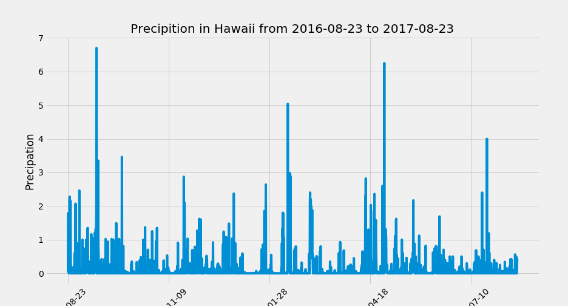
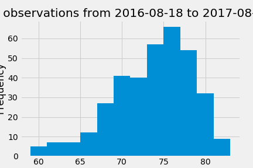
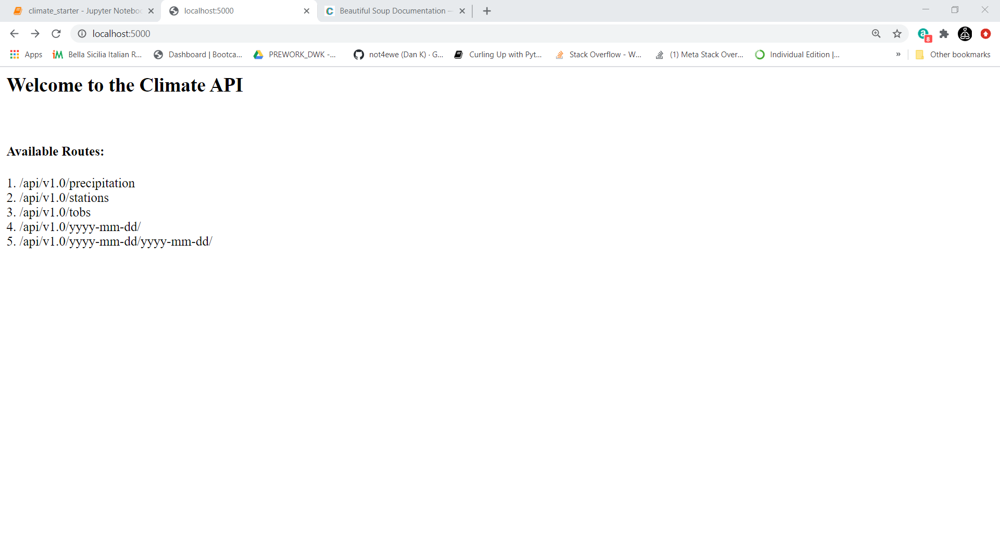

# SQLAlchemy Homework - Surfs Up!

Step 1 - Climate Analysis and Exploration
To begin, use Python and SQLAlchemy to do basic climate analysis and data exploration of your climate database. All of the following analysis should be completed using SQLAlchemy ORM queries, Pandas, and Matplotlib.

* Precipitation Analysis
  

  
* Station Analysis

  
Step 2 - Climate App
Now that you have completed your initial analysis, design a Flask API based on the queries that you have just developed.

